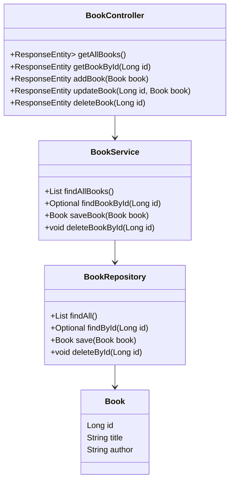

# Library Management Application

## Description
This project is a practical solution that explores the concept of Design Patterns. The objective was to create an application to manage a library of books using modern technologies and development best practices.

## Project
The project consists of a library management application where you can list, add, update, and delete books. The project was developed using the Spring Boot framework, which facilitates the development of Java applications.

## Technologies Used
- **Spring Boot**: Java framework to create applications quickly and easily.
- **PostgreSQL**: Railway-managed database for persistent data storage.
- **Swagger**: Tool to document and test APIs interactively.
- **Springdoc**: Library that automates API documentation generation using Spring Boot.
- **Railway** :.
- 

## Class Diagram

## Using the Project
- Accessing the H2 Console
- First, you need to access the H2 console to manually insert some data.
- You can access the H2 console in the browser using the following URL: http://localhost:8080/h2-console.

 ### In the "JDBC URL" field, use the same URL configured in the application.properties file, which is jdbc:h2:mem:testdb.

- Access the Database
- After accessing the H2 console, you should see an interface to access the database.
- You can use SQL to interact with the database.

### Inserting Data
-You can manually insert some data into the database using SQL statements.

- - INSERT INTO Book (title, author) VALUES ('Aventuras de Sherlock Holmes', 'Arthur Conan Doyle');INSERT INTO Book (title, author) VALUES ('O Senhor dos Anéis', 'J.R.R. Tolkien');
- - INSERT INTO Book (title, author) VALUES ('Orgulho e Preconceito', 'Jane Austen');
- - INSERT INTO Book (title, author) VALUES ('1984', 'George Orwell');
- - INSERT INTO Book (title, author) VALUES ('Cem Anos de Solidão', 'Gabriel García Márquez');
================

 * Verifying the Data
* After inserting the data, you can verify if they were inserted correctly by executing a SELECT statement to retrieve the data you inserted.

* Verifying the Data
* After inserting the data, you can verify if they were inserted correctly by executing a SELECT statement to retrieve the data you inserted.
